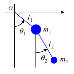
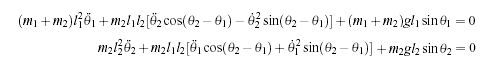

# Double-pendulum Simulation
A double-pendulum simulation using the runge-kutta method.

ルンゲ・クッタ法を用いた二重振り子のシミュレーションです。

# Demo
https://astroid-apps.github.io/double-pendulum-simulation/dist/

# Model

# Link
https://github.com/astroid-apps/pendulum-simulation
